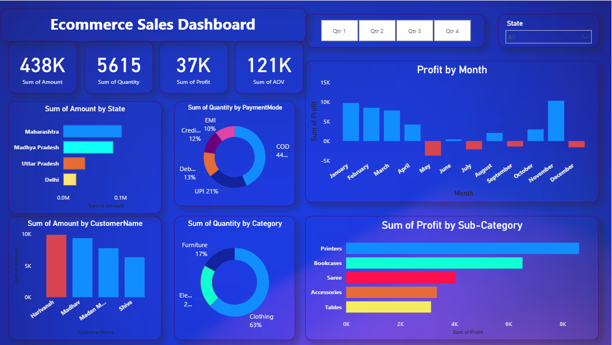

# Ecommerce Sales Performance Analysis

## 📌 Project Overview
This project focuses on analyzing ecommerce sales data to understand revenue trends, profit performance, customer behavior, and product-level insights. The goal is to support data-driven business decisions using interactive dashboards.

## 🧩 Business Problem
Management wants to track sales performance across time, regions, customers, and product categories to identify growth opportunities and profit leakages.

## 🛠 Tools & Technologies
- Power BI
- Microsoft Excel

## 📊 Key KPIs Analyzed
- Total Sales
- Total Profit
- Total Quantity
- Average Order Value (AOV)
- Monthly Sales & Profit Trends

## 📈 Dashboard Highlights
- Sales and profit trends by month
- Category and sub-category performance
- State-wise sales analysis
- Customer-level insights
- Payment mode distribution
- Interactive filters for quarter and state

## 🧠 Key Insights
- Certain sub-categories generate high revenue but low profit
- Seasonal trends observed in monthly profit
- Cash on Delivery is the most used payment mode
- A small set of customers contributes a significant share of revenue

## ✅ Business Recommendations
- Focus marketing efforts on high-profit categories
- Reduce discounts on loss-making sub-categories
- Improve digital payment adoption
- Target high-value customers with retention strategies

## 📸 Dashboard Preview

